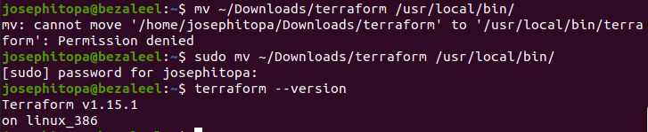

# Day 01 - [day-1: Introduction to Terraform]

---
## Objective
- What is Infrastructure as Code (IaC)?
- Terraform vs other tools
- Install Terraform & CLI basics

---
## What I Learned
- . 
- .

---
## What I Built / Practiced
- .

---
## Challenges Faced
- I couldn't install terraform using 'sudo apt install terraform'. I did manual installation of terraform.

---
## Key Takeaways
- .
- .

---
## Resources
- https://developer.hashicorp.com/terraform/install
- https://askubuntu.com/questions/983351/how-to-install-terraform-in-ubuntu
- https://developer.hashicorp.com/terraform/tutorials/aws-get-started/install-cli#install-terraform

---
## Output
(Include links, screenshots, code snippets, or results)

