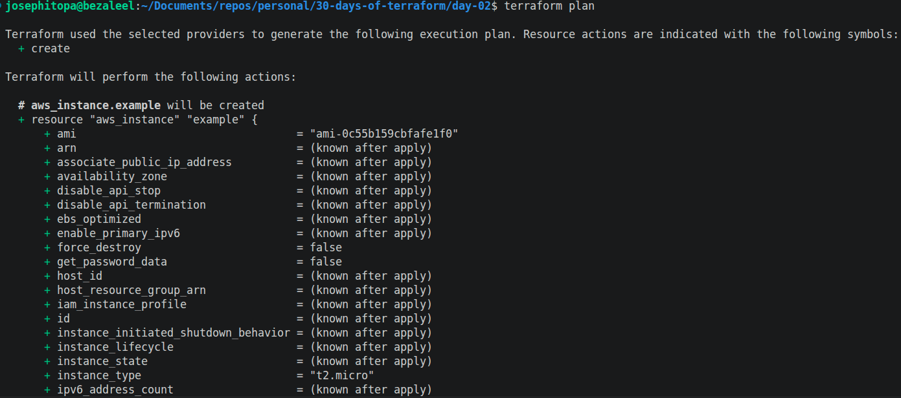
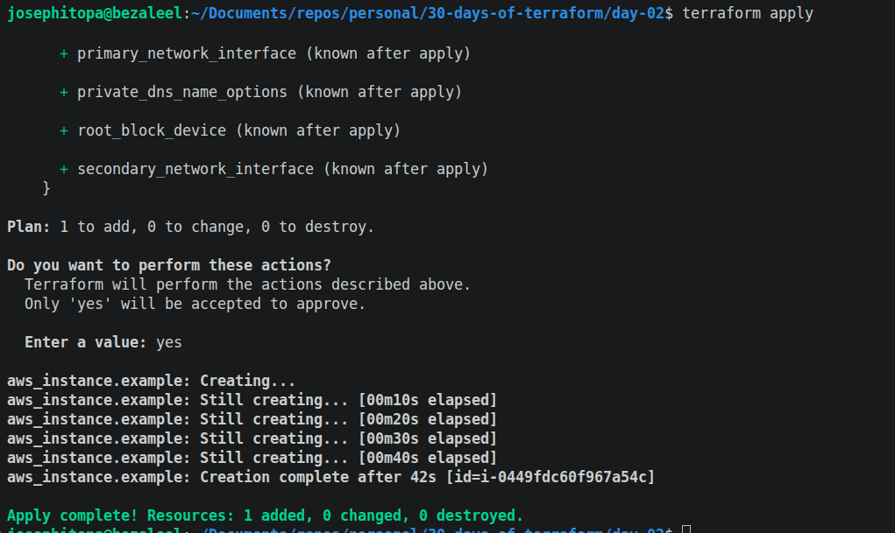
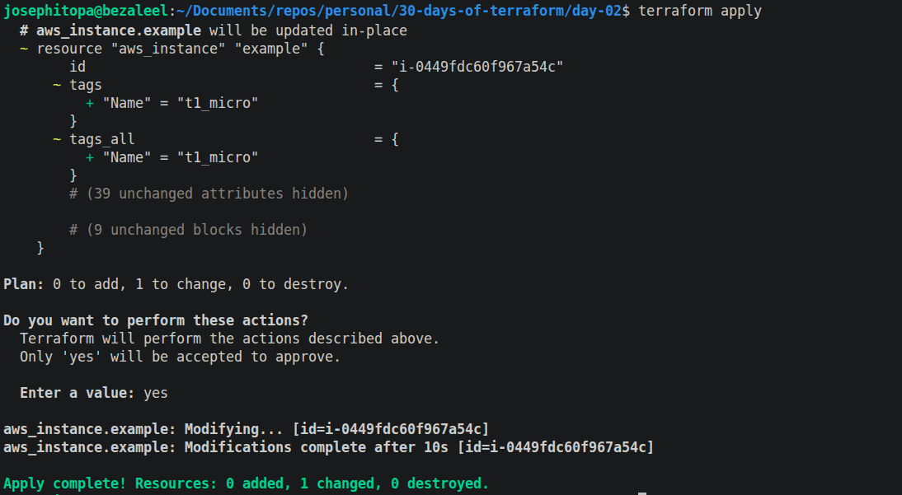
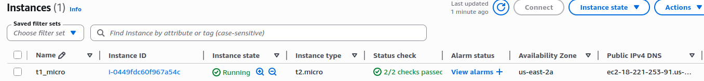

# Day 02 - [Day-2: Deploy a single server]

## Objective
- To deploy an ec2 instance server on AWS's US-EAST-2 region.

---
## What I Learned
- I learnt to deploy an ec2 instance on AWS using terraform.

---
## What I Built / Practiced
- I built a script to deploy a single t1 micro server.
- I modify the script to include tags.

---
## Challenges Faced
- I couldn't find the instance I created. I later discover, I an on a different region on the console, which is different from the region on terraform script.

---
## Key Takeaways
- To view the deployment, ensure to be in the same region on the console as the script.
- Always add tag to the ec2 instance created.
- 'terraform apply' is the same with 'terraform plan' 

---
## Resources
- Terraform Up & Running by Yevgeniy Brikman.

---
## Output
(Include links, screenshots, code snippets, or results)

