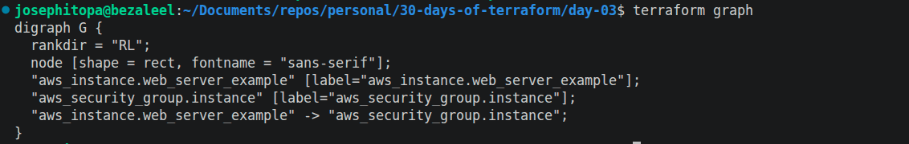
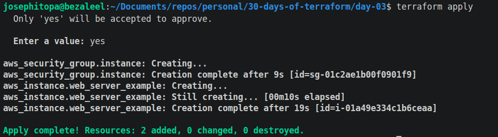
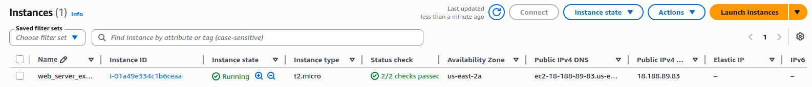
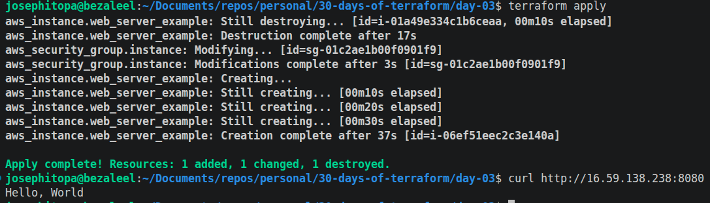
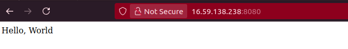

# Day 03 - [day-03: deploy a single web server]

## Objective
- To deploy a single web server on AWS.

---
## What I Learned
- I learnt to setup provider.
- I learnt to setup resources.
- I learnt to troubleshoot the terraform script.

---
## What I Built / Practiced
- I built a terraform script that setup infrastructure and deploy a web page.
- 

---
## Challenges Faced
- 'terraform graph' throws error beecause terraform hasnt been initiated.
- Error: failed to refresh cached credentials, no EC2 IMDS role found.
- I web page refuse to load. This was as a result of typo error, instead of 'nohup' I typed 'nohub'.

---
## Key Takeaways
- 'terraform graph' will not run alone until after running 'terraform init'
-  without exporting credentials, 'terraform apply' will throw error.

---
## Resources
- Terraform Up & Running by Yevgeniy Brikman.

---
## Output
(Include links, screenshots, code snippets, or results)

#### -------

#### -------

#### -------

