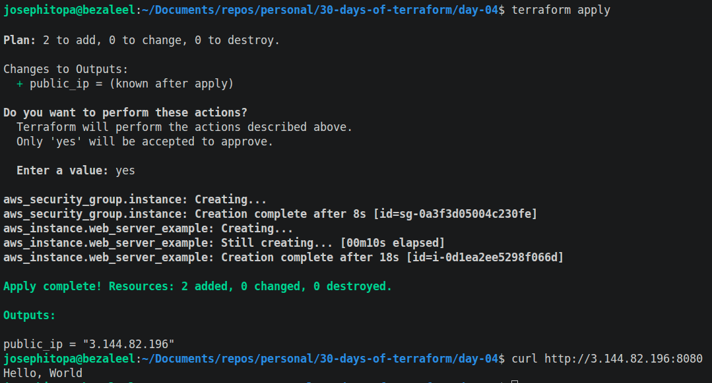
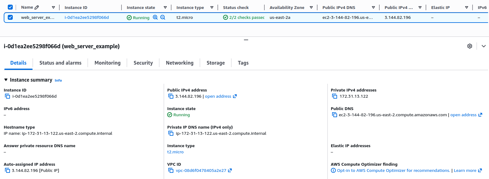

# Day 04 - [day-04: deploy a configurable web server]

## Objective
- To introduce variables for configuring terraform script so as to maintain DRY(Dont Repeat Yourself)

---
## What I Learned
- I learnt to write variables for different data types: list, number, string, etc.
- I learnt to use terraform variables for port number within terraform script.

---
## What I Built / Practiced
- I modify the web server deployment script to include variables.
- I modify the web server deployment script to print out the public ip address of the server.

---
## Challenges Faced
- None

---
## Key Takeaways
- Variables are useful in maintaining the DRY principle.
- To create a variable for server port, the type must be number and the port number is set to a default 8080.

---
## Resources
- Terraform Up & Running by Yevgeniy Brikman.

---
## Output
(Include links, screenshots, code snippets, or results)

#### --------------
