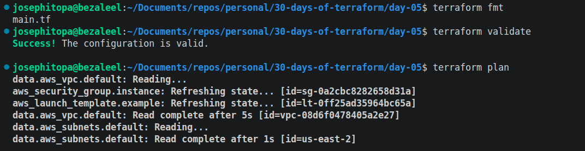
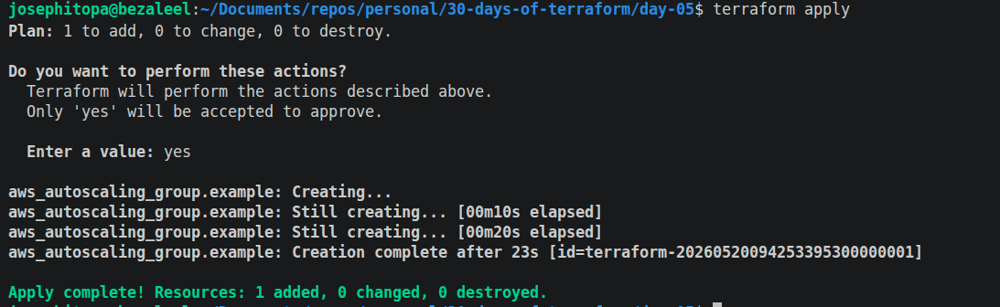
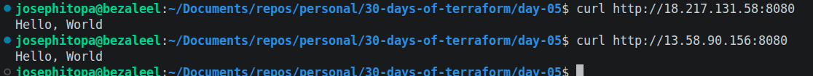
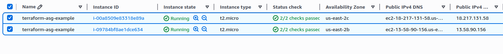

# Day 05 - [day-05: deploy a cluster of web server]

## Objective
- Run a cluster of servers, routing around servers that go down, and adjusting the size of the cluster up or down based on traffic.

---
## What I Learned
- I learnt to configure ASG for launch templates with minimum of 2 servers and maximum of 10 servers.
- I learnt to encode user data using base64 encoding.
- I learnt about life cycle; to create before it destroys old servers.

---
## What I Built / Practiced
- I built a script that adopts Auto Scaling Group to create 2 servers that host the same websites and can scale upto 10 servers.
- 

---
## Challenges Faced
- aws_subnet_ids has been removed/deprecated in newer versions of the AWS provider. Use aws_subnets instead.
- api error UnsupportedOperation: The Launch Configuration creation operation is not available in your account.

---
## Key Takeaways
- aws_launch_configuration does not expose IPs because it is only a template. 
- security_groups works with Launch Configurations, but Launch Templates use: vpc_security_group_ids.

---
## Resources
- Terraform Up & Running by Yevgeniy Brikman.

---
## Output
(Include links, screenshots, code snippets, or results)

#### ------------------

#### ------------------

#### ------------------
