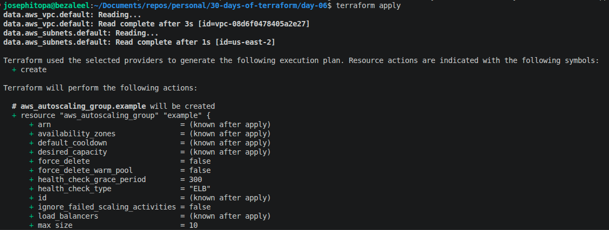
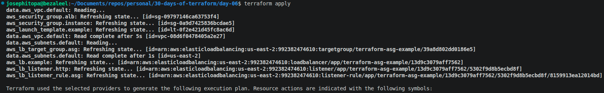
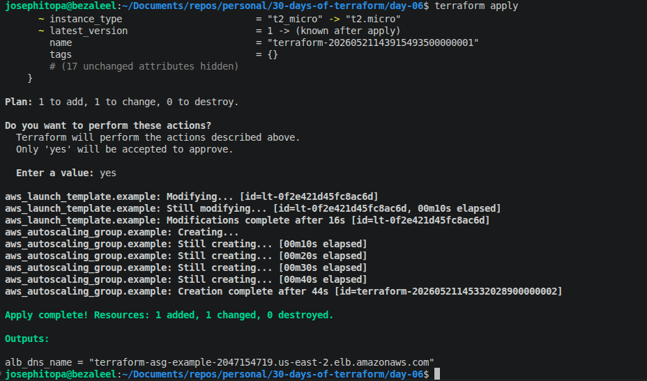
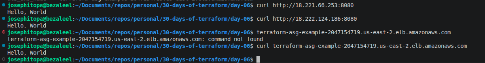

# Day 06 - [day-06: deploying a load balancer]

## Objective
- To deploy cluster of web servers on a load balancer for traffic shedding 

---
## What I Learned
- I learnt about creating a listener for load balancer.
- I learnt about creating a health check for the ec2 instances.
- I learnt about creating a target group for load balancer.

---
## What I Built / Practiced
- I built a terraform script that uses load balancer to share traffic across several cluster of webservers.

---
## Challenges Faced
- Changes to the formatting version causes failure during deployment.

---
## Key Takeaways
- A load balancer can share traffic across cluster of servers. 
- There are different types of load balancer: application load balancer, network load balancer, classic load balancer.

---
## Resources
- Terraform Up & Running by Yevgeniy Brikman.

---
## Output
(Include links, screenshots, code snippets, or results)

#### ----------------

#### ----------------

#### ----------------
