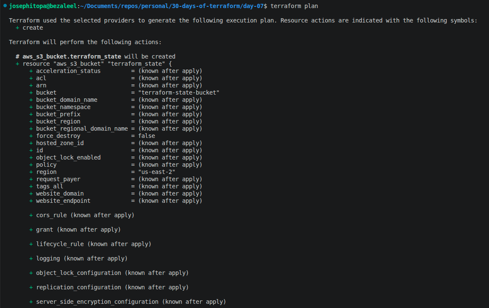
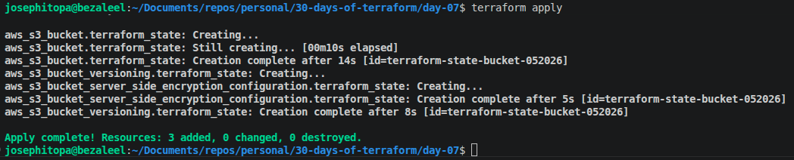
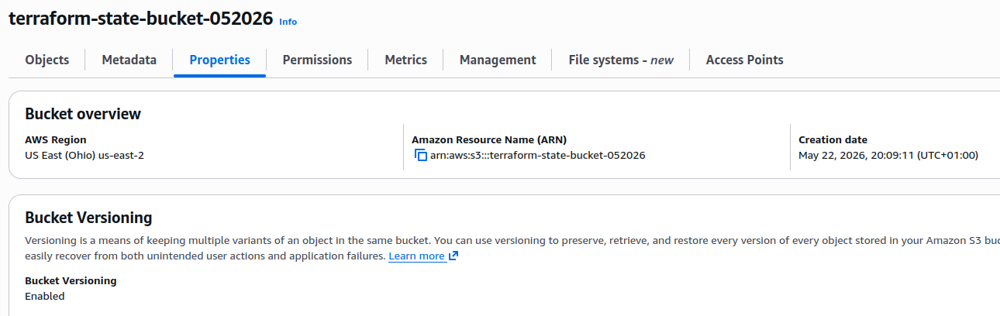

# Day 07 - [day-07: creating a secured and effective s3 bucket]

## Objective
- To create an s3 bucket with versioning and server side encryption.

---
## What I Learned
- I learnt to protect s3 bucket from being destroyed mistakenly.
- I learnt to enable versioning to protect files from updating by deleting previous version.
- I learnt to enable server side encryption of files.

---
## What I Built / Practiced
- I built a terraform script that can create an s3 bucket with server-side encryption and versioning enabled.
- 

---
## Challenges Faced
- The previous way of creating an s3 bucket in terraform, involves the creation of s3 bucket, versioning, and encryption in one resource. Currently, it requires separate resources.
- 

---
## Key Takeaways
- To create an efficient s3 bucket requires several resources: a) s3 bucket resource, b) versioning resource, c) encryption resource;
- 

---
## Resources
- Terraform Up & Running by Yevgeniy Brikman.

---
## Output
(Include links, screenshots, code snippets, or results)
#### -----------------

#### -----------------

#### ----------------
